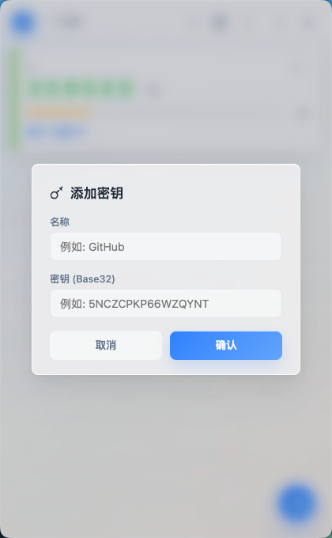
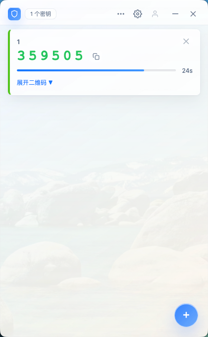
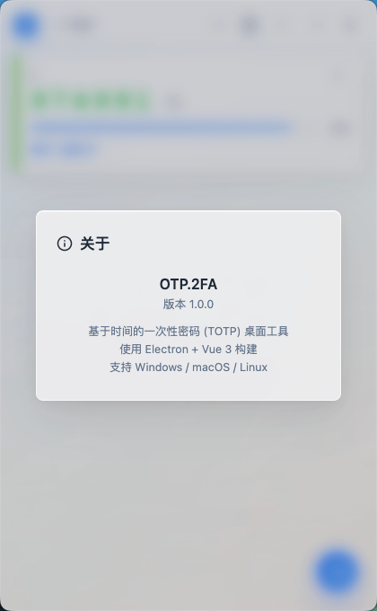
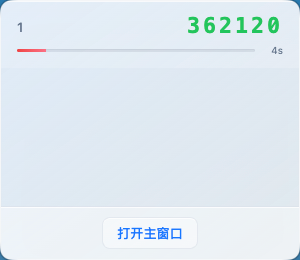
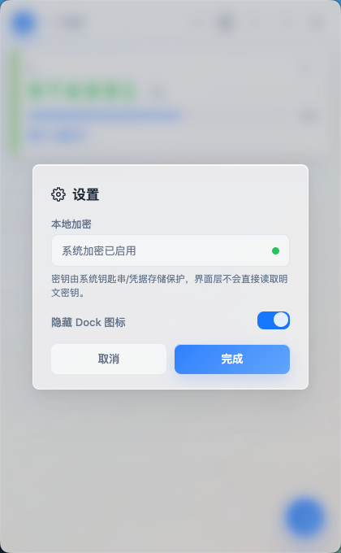

# OTP.2FA

一个基于 Electron + Vue 3 构建的桌面端 TOTP 双因素认证（2FA）验证码管理工具。遵循 RFC 6238 标准，所有密钥本地加密存储，无需联网，保护你的账户安全。



## 功能特性

- **TOTP 验证码管理** — 添加、查看、删除 2FA 密钥，实时生成 6 位验证码
- **每 30 秒自动轮换** — 验证码按 RFC 6238 标准周期刷新，进度条直观显示剩余时间
- **一键复制** — 点击验证码即可复制到剪贴板，附带反馈提示
- **二维码生成** — 每个密钥自动生成标准 `otpauth://` 格式 QR 码，支持展开收起
- **系统托盘** — 驻留系统托盘，左键弹出小型窗口快速查看最近密钥，右键菜单快捷操作
- **本地加密存储** — 密钥经 AES-256-GCM 或操作系统原生安全存储（macOS Keychain / Windows Credential Store）加密后保存在本地
- **磨砂玻璃界面** — 全应用 CSS `backdrop-filter: blur()` 毛玻璃质感设计
- **跨平台打包** — 支持 macOS、Windows、Linux 三平台分发

## 截图

| 主界面 | 添加密钥 | 设置 | 托盘弹出 |
|:---:|:---:|:---:|:---:|
|  |  |  |  |

## 快速开始

### 环境要求

- Node.js >= 18
- npm >= 9

### 安装与运行

```bash
# 克隆仓库
git clone https://github.com/bambuo/otp2fa-electron.git
cd totp-app

# 安装依赖
npm install

# 开发模式启动（Vite + Electron 并行启动）
npm run dev:all

# 或分别启动
npm run dev          # 启动 Vite 开发服务器
npm run dev:electron # 启动 Electron
```

### 生产构建与打包

```bash
# Vite 生产构建
npm run build

# 以生产模式启动
npm run start

# 生成平台安装包
npm run dist
```

## 使用指南

1. **添加密钥** — 点击主界面底部的 "+" 按钮，输入名称和 Base32 格式的密钥
2. **查看验证码** — 每个密钥卡片显示当前验证码、上一周期和下一周期的验证码
3. **复制验证码** — 点击验证码数字或复制图标，自动复制到剪贴板
4. **查看 QR 码** — 点击密钥卡片上的二维码图标展开标准 `otpauth://` 二维码
5. **删除密钥** — 点击密钥卡片上的 "X" 按钮确认删除
6. **系统托盘** — 关闭窗口后应用驻留托盘，左键弹出快速查看窗口，右键退出
7. **设置** — 点击标题栏设置按钮，可切换 Dock 图标隐藏、查看加密状态

## 开发

### 项目结构

```
totp-app/
├── electron/          # Electron 主进程
│   ├── main.js        # 主进程入口（窗口管理、IPC、托盘）
│   ├── preload.js     # 预加载脚本（安全上下文桥接）
│   └── qr.js          # 纯 JS QR 码生成器（无外部依赖）
├── src/               # 前端源码（Vue 3）
│   ├── App.vue        # 根组件（含全部 UI 样式）
│   ├── main.js        # Vue 应用入口
│   ├── components/    # UI 组件
│   │   ├── app/       # 应用级组件（标题栏、关于）
│   │   ├── totp/      # TOTP 相关组件（密钥列表、添加弹窗）
│   │   └── settings/  # 设置组件
│   ├── composables/   # 组合式函数
│   └── services/      # Electron API 封装
├── build/             # 应用图标
├── docs/              # 文档截图
├── index.html         # 主应用入口
├── popup.html         # 托盘弹出窗口入口
├── vite.config.js     # Vite 构建配置
└── package.json
```

### 技术栈

| 技术 | 用途 |
|------|------|
| Electron | 桌面应用框架 |
| Vue 3 | 前端 UI 框架 |
| Vite | 构建工具 |
| electron-builder | 应用打包分发 |

### 核心架构

```
Electron 主进程 ──IPC── preload.js ──IPC── 渲染进程 (Vue 3)
     │                                            │
     ├─ 文件存储 (data.json)                      ├─ AppTitlebar
     ├─ TOTP 算法 (RFC 6238)                      ├─ KeyList → KeyCard
     ├─ QR 码生成器                                ├─ AddKeyModal
     └─ 加密解密                                   └─ SettingsModal
```

数据以 JSON 格式持久化存储在 `~/.otp2fa/data.json` 中，密钥字段经过 AES-256-GCM 或操作系统安全存储加密。

## 安全

- **上下文隔离** — Electron 启用 `contextIsolation: true` 和 `sandbox: true`
- **密钥加密** — 优先使用操作系统原生加密（macOS Keychain / Windows Credential Store），回退至用户自定义 Salt + AES-256-GCM
- **自动迁移** — 旧版加密密钥在启动时自动迁移至 `safeStorage`
- **密钥脱敏** — 前端只接收密钥元数据（id, name, createdAt），不解密明文
- **CSP 策略** — 严格的 Content-Security-Policy，仅允许 `'self'` 和 `data:` 资源

## 构建分发

通过 `electron-builder` 支持以下平台打包：

| 平台 | 格式 | 架构 |
|------|------|------|
| macOS | DMG | arm64 |
| Windows | NSIS 安装器 | x64, ia32 |
| Linux | AppImage | x64, arm64 |

## 常见问题

**密钥存储在哪里？**

所有密钥加密后存储在用户目录的 `~/.otp2fa/data.json` 文件中。

**忘记加密密码怎么办？**

应用使用操作系统原生加密（macOS Keychain / Windows Credential Store）作为首选方案，无需记忆额外密码。若使用自定义 Salt 加密，请确保不要丢失配置。

**验证码不刷新怎么办？**

确保系统时间准确同步。TOTP 算法依赖客户端时间的精确性，时间偏差过大会导致验证码不匹配。

## 反馈

如有问题或建议，请提交 [GitHub Issues](https://github.com/bambuo/otp2fa-electron/issues)。
